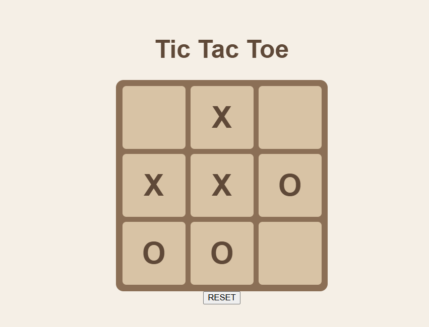

# Tic Tac Toe

Classic tic tac toe, X versus O, with a reset button. Morning challenge build, warm beige board included.

## How it works

Nine squares, two players taking turns. Clicking a square stamps the current player's mark and flips the turn to the other side. After every move the board checks the eight winning lines, three rows, three columns, two diagonals, and calls the game on a match or a full board with no winner. The reset button clears all nine squares and hands the first move back to X.

The win check is the part worth thinking about. It has to run after every single move, cover all eight lines, and never miss the diagonals, which are always the ones people forget. The clean way to do it is a list of winning index triples checked in a loop, so the logic stays O(1) per move no matter how the board looks. Simple game, but it's a nice little exercise in exhaustive state checking.

Built with HTML, CSS, and vanilla JavaScript. My code is on the `answer` branch.
